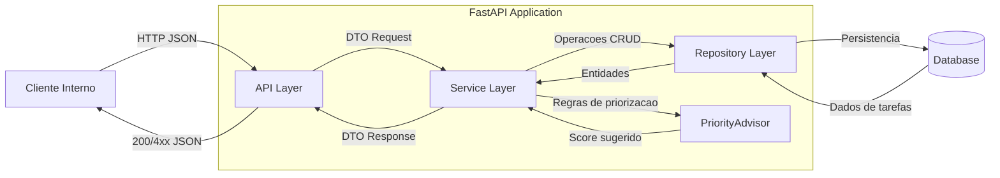

# Arquitetura - Micro-API de Tarefas

```mermaid
flowchart LR
    U[Cliente Interno]

    subgraph APP[FastAPI Application]
        API[API Layer]
        SVC[Service Layer]
        REPO[Repository Layer]
        PA[PriorityAdvisor]
    end

    DB[(Database)]

    U -->|HTTP JSON| API
    API -->|DTO Request| SVC
    SVC -->|Regras de priorizacao| PA
    PA -->|Score sugerido| SVC
    SVC -->|Operacoes CRUD| REPO
    REPO -->|Persistencia| DB
    DB -->|Dados de tarefas| REPO
    REPO -->|Entidades| SVC
    SVC -->|DTO Response| API
    API -->|200/4xx JSON| U
```
