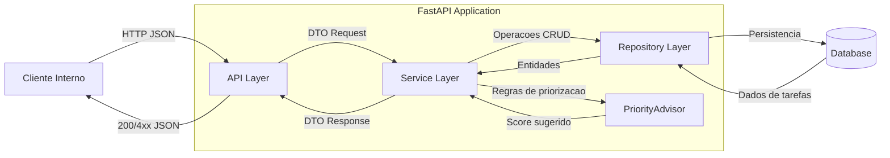

# Micro-API de Tarefas com Priorização Assistida por IA

## Visão Geral

MVP de uma micro-API para gestão de tarefas, com priorização sugerida por heurística local e opcionalmente por IA (OpenAI). Foco em arquitetura limpa, testes e facilidade de evolução.

---

## Instalação

### Pré-requisitos

- Python 3.11+
- Git

### Passos

1. Clone o repositório:
   ```bash
   git clone <url-do-repositorio>
   cd Laboratorio-Projeto
   ```

2. Crie e ative o ambiente virtual:
   - **Windows:**
     ```powershell
     python -m venv .venv
     .\.venv\Scripts\Activate.ps1
     ```
   - **Linux/macOS:**
     ```bash
     python3 -m venv .venv
     source .venv/bin/activate
     ```

3. Instale as dependências:
   ```bash
   pip install fastapi uvicorn[standard] pydantic requests
   ```
   Para desenvolvimento:
   ```bash
   pip install pytest ruff
   ```

---

## Execução

1. Certifique-se de que o arquivo `app/main.py` instancia um objeto FastAPI.
2. Execute o servidor:
   ```bash
   uvicorn app.main:app --reload
   ```
3. Acesse:
   - API: http://127.0.0.1:8000
   - Docs: http://127.0.0.1:8000/docs

---

## Testes

Execute todos os testes com:
```bash
pytest
```
- Testes de unidade: `tests/test_task_service.py`, `tests/test_priority_advisor.py`
- Testes de integração de rotas: `tests/test_task_routes.py`

---

## Arquitetura



- **API Layer:** Rotas FastAPI, validação e status HTTP.
- **Service Layer:** Regras de negócio, orquestração e fallback.
- **Repository Layer:** Persistência em memória (MVP).
- **PriorityAdvisor:** Sugestão de prioridade (heurística local e IA).

---

## Uso da IA

- Por padrão, a prioridade é sugerida por heurística local (urgência, palavras-chave).
- Se a variável de ambiente `OPENAI_API_KEY` estiver definida, a API tentará usar o modelo OpenAI para sugerir prioridade.
- Sempre há fallback seguro para heurística local em caso de erro ou timeout.

---

## Limitações

- Persistência apenas em memória (dados somem ao reiniciar).
- Sem autenticação/autorização.
- Sem controle de concorrência para múltiplos usuários.
- Priorização IA depende de chave e acesso à internet.
- Validações de negócio mínimas (ex: datas no passado não são bloqueadas).

---

## Próximos Passos

- Adicionar persistência real (SQLite/PostgreSQL).
- Melhorar validações de entrada e regras de negócio.
- Implementar autenticação e controle de acesso.
- Expor endpoint dedicado para sugestão de prioridade.
- Containerização (Docker) e CI/CD.
- Monitoramento e logs estruturados.
- Evoluir heurística e integração IA conforme feedback.

---
