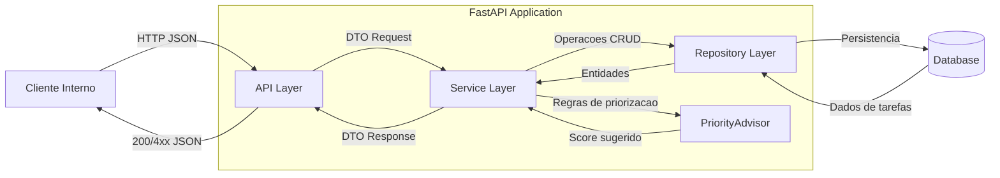

# Micro-API de Tarefas com Priorização Assistida por IA

## Visão Geral

MVP de uma micro-API para gestão de tarefas, com priorização sugerida por heurística local e opcionalmente por IA (OpenAI). Foco em arquitetura limpa, testes e facilidade de evolução.

---


## Instalação

### Pré-requisitos
- Python 3.11+
- Git
- (Opcional) Make para automação dos comandos

### Passos
1. Clone o repositório:
    ```bash
    git clone <url-do-repositorio>
    cd Laboratorio-Projeto
    ```

2. Copie o arquivo de variáveis de ambiente:
    ```bash
    cp .env.example .env
    # Edite .env se desejar usar a IA (OpenAI)
    ```

3. Instale as dependências:
    - Com Make (recomendado):
       ```bash
       make install
       ```
    - Manualmente:
       - **Windows:**
          ```powershell
          python -m venv .venv
          .\.venv\Scripts\Activate.ps1
          pip install --upgrade pip
          pip install -r requirements.txt
          pip install fastapi uvicorn[standard] pytest pytest-cov
          ```
       - **Linux/macOS:**
          ```bash
          python3 -m venv .venv
          source .venv/bin/activate
          pip install --upgrade pip
          pip install -r requirements.txt
          pip install fastapi uvicorn[standard] pytest pytest-cov
          ```


---


## Execução

1. Certifique-se de que o arquivo `app/main.py` instancia um objeto FastAPI.
2. Execute o servidor:
   - Com Make:
     ```bash
     make run
     ```
   - Manualmente:
     ```bash
     .venv/Scripts/uvicorn.exe app.main:app --reload  # Windows
     # ou
     .venv/bin/uvicorn app.main:app --reload  # Linux/macOS
     ```
3. Acesse:
   - API: http://127.0.0.1:8000
   - Docs interativas: http://127.0.0.1:8000/docs

### Exemplos de uso via HTTP (curl)

Criar tarefa:
```bash
curl -X POST http://127.0.0.1:8000/tasks/ -H "Content-Type: application/json" -d '{"title": "Minha tarefa", "description": "desc", "completed": false}'
```

Listar tarefas:
```bash
curl http://127.0.0.1:8000/tasks/
```

Veja mais exemplos na documentação interativa (/docs).

---


## Testes

Execute todos os testes com:
```bash
make test
# ou
pytest
```
- Testes de unidade: `tests/test_task_service.py`, `tests/test_priority_advisor.py`
- Testes de integração de rotas: `tests/test_task_routes.py`

Para relatório de cobertura:
```bash
pytest --cov=app --cov-report=term-missing
```

---

## Arquitetura



- **API Layer:** Rotas FastAPI, validação e status HTTP.
- **Service Layer:** Regras de negócio, orquestração e fallback.
- **Repository Layer:** Persistência em memória (MVP).
- **PriorityAdvisor:** Sugestão de prioridade (heurística local e IA).

---


## Uso da IA (Prioridade por LLM)

- Por padrão, a prioridade é sugerida por heurística local (urgência, palavras-chave).
- Para ativar a sugestão por IA, defina a variável de ambiente `OPENAI_API_KEY` no arquivo `.env`:
   ```env
   OPENAI_API_KEY=sua-chave-openai-aqui
   ```
- Se a chave não estiver definida ou ocorrer erro/timeout, o sistema faz fallback automático para heurística local.
- Exemplo de resposta com IA ativa: a prioridade pode ser "alta", "normal" ou "baixa" conforme análise do modelo.
- Exemplo de resposta com heurística local: prioridade baseada em data de entrega e palavras-chave.
- Consulte `.env.example` para configuração.
- Saiba mais sobre a API OpenAI em: https://platform.openai.com/docs/api-reference

---


## Limitações/Recomendações

- Persistência apenas em memória (dados somem ao reiniciar).
- Sem autenticação/autorização.
- Sem controle de concorrência para múltiplos usuários.
- Priorização IA depende de chave e acesso à internet.
- Validações de negócio mínimas (ex: datas no passado não são bloqueadas).

---


## Próximos Passos/Sugestões

- Adicionar persistência real (SQLite/PostgreSQL).
- Melhorar validações de entrada e regras de negócio.
- Implementar autenticação e controle de acesso.
- Expor endpoint dedicado para sugestão de prioridade.
- Containerização (Docker) e CI/CD.
- Monitoramento e logs estruturados.
- Evoluir heurística e integração IA conforme feedback.

---
